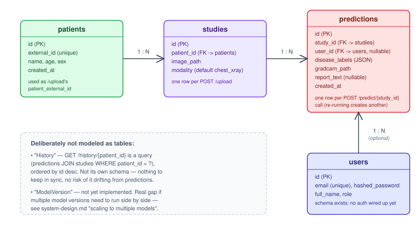

# Database



## Tables

### `patients` (`app/database/patient_model.py`)
| Column | Type | Notes |
|---|---|---|
| `id` | int, PK | |
| `external_id` | string, unique, indexed | Caller-supplied ID — the value passed as `patient_external_id` to `POST /upload` and as the path param to `GET /history/{patient_id}`. This is the identifier the outside world uses; `id` is internal. |
| `name`, `age`, `sex` | nullable | Not currently populated by any route — schema is ahead of the API here. |
| `created_at` | timestamp | server default `now()` |

### `studies` (`app/database/patient_model.py`)
One row per successful `POST /upload` call.

| Column | Type | Notes |
|---|---|---|
| `id` | int, PK | Returned as `study_id` from `/upload`, used as the path param for `/predict/{study_id}` |
| `patient_id` | FK -> `patients.id` | |
| `image_path` | string | Path under `storage/uploads/...`, set by `StorageService.save()` |
| `modality` | string | Defaults to `"chest_xray"` — field exists for future non-CXR modalities |
| `created_at` | timestamp | |

### `predictions` (`app/database/prediction_model.py`)
One row per successful `POST /predict/{study_id}` call. Calling `/predict` again on the same study
creates another row, not an update — every prediction run is preserved, which is exactly what
`/history` reads back.

| Column | Type | Notes |
|---|---|---|
| `id` | int, PK | History is ordered by this, not `created_at` (see below) |
| `study_id` | FK -> `studies.id` | |
| `user_id` | FK -> `users.id`, nullable | Schema supports attributing a prediction to a clinician; nothing sets this today — no auth yet |
| `disease_labels` | JSON | `{class_name: probability}` for all 14 classes in `config.yaml` |
| `gradcam_path` | string | Path under `storage/gradcam/...` |
| `report_text` | string, nullable | `null` if the LLM wasn't configured or failed — not an error state |
| `created_at` | timestamp | |

### `users` (`app/database/user_model.py`)
| Column | Type | Notes |
|---|---|---|
| `id` | int, PK | |
| `email` | string, unique | |
| `hashed_password` | string | Column exists; nothing hashes or checks a password yet — see [known-limitations.md](known-limitations.md) |
| `full_name`, `role` | nullable | `role` defaults to `"clinician"` |
| `created_at` | timestamp | |

## Relationships

`Patient` 1—N `Study` 1—N `Prediction` N—1 `User` (optional). See `app/database/*_model.py` for the
SQLAlchemy `relationship()` declarations.

## Deliberately not modeled as tables

- **"History"** — `GET /history/{patient_id}` is a query
  (`predictions JOIN studies WHERE patient_id = ?`, ordered by `id desc`), not its own schema.
  A `history` table would just be a denormalized copy of `predictions`/`studies` that could drift
  out of sync; the join costs nothing at this scale and can never be stale.
- **"ModelVersion"** — genuinely not implemented, and a real gap if multiple model versions ever
  need to run side by side (a newly retrained model shouldn't invalidate history from an older
  one). See [system-design.md](system-design.md)'s "scaling to multiple models" section for the
  concrete shape this would take (`model_versions` table + `Prediction.model_version_id` FK).

## Schema management

Schema changes go through Alembic, never `Base.metadata.create_all()` in application code:
```bash
alembic upgrade head                              # apply migrations
alembic revision --autogenerate -m "add X to Y"    # after changing a model
```
`alembic/env.py` reads the DB URL from `app.config.settings` (i.e. `.env`), not from
`alembic.ini` — don't hardcode a connection string there. Importing `app.database` (the package
`__init__.py`) registers all three model modules on the mapper registry, which matters even if a
given file only needs one model directly: SQLAlchemy resolves `Prediction.user =
relationship("User")` (a string reference) by looking up whatever classes have been imported
*somewhere*, not just the ones the current module references. Skipping this caused a real
`KeyError: 'User'` in production once — see `docs/roadmap.md`'s `feature/gradcam` entry.

## Postgres vs. SQLite

Identical schema either way — see [system-design.md](system-design.md) for why SQLite is the local
default and Postgres is what `docker-compose`'s `db` service and production actually run.
