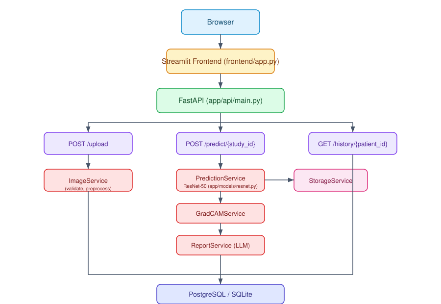
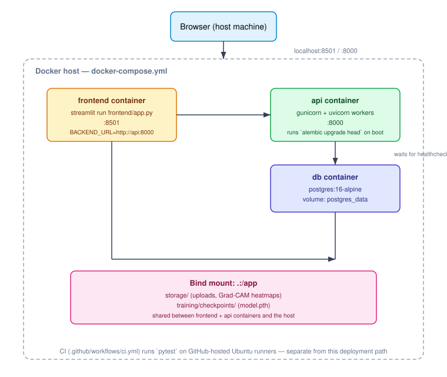

# MedX AI — Project Report

*A chest X-ray disease prediction, explainability, and reporting platform.*

## 1. Executive Summary

MedX AI is an end-to-end medical imaging pipeline: a clinician uploads a chest X-ray, a ResNet-50
model predicts probabilities across 14 thoracic conditions, Grad-CAM produces a visual explanation
of where the model looked, an LLM turns the raw probabilities into a narrative report, and the
result is persisted and retrievable per patient — all behind a REST API with a working Streamlit
frontend, containerized with Docker Compose, and continuously tested via GitHub Actions.

The project is tagged `v1.1.0` on `main`. Every stage of the pipeline is real and wired, not
scaffolding: the model has been trained on genuine chest X-rays (not just synthetic data), the API
has been exercised end-to-end against a real Postgres database in real Docker containers, and the
Grad-CAM output has been visually inspected, not just unit-tested. It was built as a sequence of
small, reviewed pull requests — infrastructure and data model before any AI code — which is
documented in full in [roadmap.md](roadmap.md).

What this report will not claim: that the model is clinically accurate, or that this is a finished
medical product. Section 13 and [known-limitations.md](known-limitations.md) say plainly what
isn't done yet.

## 2. Problem Statement

Chest X-rays are one of the most common diagnostic imaging studies, and manual review is slow
relative to imaging volume. Automated triage/classification tools can help, but two things
routinely go missing from prototype AI diagnostic tools: **explainability** (a probability score
with no indication of *why* is not something a clinician can act on) and **a usable delivery
mechanism** (a model in a notebook is not a tool anyone can use). MedX AI addresses both: every
prediction ships with a Grad-CAM localization and a narrative report, delivered through a real API
and UI, not a script that has to be re-run by hand.

## 3. Objectives

- Predict the presence of 14 thoracic conditions from a chest X-ray image (multi-label, not
  single-diagnosis).
- Explain each prediction visually (Grad-CAM), not just numerically.
- Generate a clinician-readable narrative report from the raw prediction, not just a probability
  table.
- Expose all of the above through a versioned REST API with real request/response contracts
  (documented in [api.md](api.md)), not an ad hoc script interface.
- Persist every prediction so a patient's history can be retrieved later.
- Containerize the whole system so it runs the same way in development and in a
  production-shaped environment (Postgres, multi-worker serving, CI).
- Be honest, in the documentation, about what has and hasn't actually been validated.

## 4. System Architecture



```
User -> Streamlit Frontend -> FastAPI -> Inference Pipeline -> ResNet-50 -> Grad-CAM
      -> LLM Report -> Postgres/SQLite -> API Response -> Frontend
```

The system is layered so that no layer knows about the internals of the one two steps away — the
API routes never touch `torch` or `PIL` directly, and the model/Grad-CAM/report services never
touch HTTP. Full component and sequence diagrams, and the reasoning behind the layering, are in
[architecture.md](architecture.md) and [system-design.md](system-design.md); the exact call
sequence for a prediction is in [sequence-predict.svg](images/sequence-predict.svg).

## 5. Technology Stack (and why)

| Technology | Role | Why (full reasoning in [system-design.md](system-design.md)) |
|---|---|---|
| **FastAPI** | REST API | Async, Pydantic-validated request/response contracts, free auto-generated OpenAPI docs — chosen over Flask for exactly the parts of this project that need typed contracts and multiple routers. |
| **ResNet-50** (torchvision, ImageNet-pretrained) | Disease prediction | Transfer learning makes a small dataset viable at all; an established, published baseline for this exact task (multi-label chest X-ray classification) rather than an untested architecture choice. |
| **Grad-CAM** (`pytorch_grad_cam`) | Explainability | Post-hoc — explains the trained model without changing its architecture or retraining it; the standard method in published medical-imaging XAI work. |
| **OpenAI API** (configurable) | LLM report generation | Turns 14 raw probabilities into the narrative format a radiology report actually uses; designed to fail gracefully (`report_text: null`), never to block a diagnosis on an LLM being reachable. |
| **PostgreSQL** (prod) / **SQLite** (dev+test default) | Persistence | Postgres for real concurrent-write correctness in production; SQLite for zero-setup local development and fast, isolated tests — identical schema either way via SQLAlchemy + Alembic. |
| **Alembic** | Schema migrations | Reviewable, reversible schema changes instead of implicit `create_all()` calls that can silently diverge between environments. |
| **Streamlit** | Frontend | Fastest path to a usable UI on top of a Python ML stack, without a separate frontend build/deploy pipeline. |
| **Docker / Docker Compose** | Deployment | One `docker-compose up` brings up API + Postgres + frontend together, matching production shape locally. |
| **pytest + GitHub Actions** | Testing / CI | Every push and PR to `main`/`develop` runs the full suite automatically — see Section 11. |

## 6. Dataset

Training uses **NIH ChestX-ray14** — 14 thoracic conditions, the same taxonomy used throughout
this project's `config.yaml` and database schema. Because Kaggle credentials and the official NIH
box.com host weren't accessible in the build environment, `scripts/download_sample_data.py` pulls
a real subset (~2,000 images with genuine multi-label annotations) from a public,
no-credential-required Hugging Face mirror instead — see [model.md](model.md) for the exact
approach and [roadmap.md](roadmap.md)'s `feature/real-data` entry for how that dead end was found
and worked around. `DummyChestXrayDataset` (random tensors) exists separately for fast pipeline
smoke-testing without any network dependency — it is never used to make a claim about model
accuracy.

**Honest framing:** 2,000 images is a meaningful pipeline-validation sample, still not a training
set sized for a clinically usable model. See Section 12 and 13.

## 7. Model Development

```
Dataset -> Preprocessing -> Training -> Validation -> Checkpoint -> Inference
```

ResNet-50 (ImageNet-pretrained) with its final layer replaced for 14-way multi-label output
(`BCEWithLogitsLoss` with per-class `pos_weight` for class-imbalance correction, independent
sigmoid per class — not softmax, since a single X-ray can show multiple findings at once). Adam
optimizer with a `CosineAnnealingLR` schedule. Preprocessing: RGB conversion, resize to 224×224,
ImageNet normalization, with random-crop/flip augmentation during training only.

Validated with per-label and averaged AUC (`sklearn.roc_auc_score`) on an 80/20 held-out split. A
real, seeded training run against 2,000 real images for 10 epochs produced **best val AUC 0.72
(epoch 3)** — genuine learning, on genuine data, far short of the documented target (AUC ≥ 0.90,
matching published full-dataset baselines). The model reproducibly overfits after ~3-5 epochs at
this scale (train loss kept falling to 0.14 by epoch 10 while val AUC drifted down) — seen on three
separate runs, which is why the checkpoint saved to disk is now the *best* epoch by val AUC, not simply the
last one. Full detail in [model.md](model.md).

## 8. Explainability (Grad-CAM)

Grad-CAM runs on the trained model's final convolutional block (`layer4`) for the top-predicted
class, producing a heatmap overlay saved alongside the prediction. This was generated and visually
inspected against a real X-ray during development, not just unit-tested for output shape — see the
worked example in [model.md](model.md). It has not been reviewed by a radiologist for clinical
plausibility; that gap is stated directly in [known-limitations.md](known-limitations.md) rather
than implied to be more than it is.

## 9. LLM Integration

`ReportService` sends the sorted disease-probability findings to the LLM configured in
`config.yaml` (`gpt-4o-mini` by default) and returns a narrative report. The integration is
designed around failure, not just success: if no `LLM_API_KEY` is configured or the call fails for
any reason, the failure is caught and logged, `report_text` is `null`, and the rest of the
prediction (probabilities + Grad-CAM) still returns successfully — a report should never be able to
hide or block a diagnosis that was already computed. This graceful-degradation path has been
exercised for real (no API key is configured in the build/CI environment); the actual LLM call
path is verified with a mocked client in tests, since no key was available to test against the
real API — noted plainly rather than glossed over.

## 10. Deployment



Three Docker Compose services: `db` (Postgres 16, healthchecked), `api` (Gunicorn + Uvicorn
workers, runs `alembic upgrade head` on boot), `frontend` (Streamlit, reaching `api` over the
Docker network). Full detail, including two real bugs caught only by actually running the
containers (a missing system library crash-looping the container, and an obsolete Compose config
key), is in [deployment.md](deployment.md).

## 11. Testing Strategy

30 automated tests (`pytest`, run on every push/PR to `main`/`develop` via GitHub Actions) cover
model construction, preprocessing, the dataset loader, the training loop, every service
(`ImageService`, `PredictionService`, `GradCAMService`, `ReportService`, `StorageService`),
every API route (with dependency-injected throwaway databases, not a shared test DB), Alembic
migrations (upgrade *and* downgrade), and a Streamlit `AppTest` smoke test for the frontend.

Beyond automated tests, every feature in this project was **manually verified against a real
running server** before being considered done — not just "tests pass." That includes: real `curl`
calls against a live `uvicorn` process, a full build-and-run of the actual Docker Compose stack
(including a genuine Postgres container, verified via direct `psql` queries, not just application
logs), and a real trained checkpoint run through prediction and Grad-CAM on an actual image. Real
bugs were caught this way that no unit test would have found — the `libGL.so.1` container
crash-loop (Section 10) and a `KeyError: 'User'` from an unregistered SQLAlchemy model
(`docs/database.md`) both surfaced only when the running system was actually exercised.

## 12. Results

- Full pipeline (`upload → predict → Grad-CAM → report → history`) works end-to-end over real
  HTTP, against real Postgres, in real Docker containers — not just in isolated unit tests.
- A real (if small) training run on genuine chest X-ray data shows the model learning: best val
  AUC 0.72 (epoch 3 of 10, seeded run), with a reproducible overfitting pattern past that point.
- Grad-CAM produces a real, visually-inspected heatmap overlay for a real prediction.
- Report generation's failure path (no LLM configured) was exercised for real and confirmed not to
  break the rest of the response.
- 30/30 automated tests pass; CI is green on every push.

## 13. Known Limitations

Full list, with reasoning, in [known-limitations.md](known-limitations.md). Summary:

- Only ~2,000 training images used, and the model overfits within ~5 epochs at that scale — proves
  the pipeline works, not a clinically meaningful model.
- No clinical validation of Grad-CAM output; not FDA approved; educational purpose only.
- **No authentication or access control on any endpoint** — the single biggest gap for anything
  beyond a local demo. `Prediction.user_id` and the `users` table exist in the schema but nothing
  populates or checks them yet.
- Audit logging limited to request-level middleware (method/path/status), not a structured
  per-inference "who viewed what" trail.
- No PACS/DICOM integration — accepts plain PNG/JPEG, not the format real radiology systems use.
- No model versioning — only one active checkpoint at a time (see
  [system-design.md](system-design.md)'s scaling section for the concrete fix).

## 14. Future Improvements

- **Authentication (JWT/OAuth2)** on all patient-data endpoints — the clear top priority.
- **Scale up real training data further** (tens of thousands of images, stratified train/val
  split, explicit early stopping) toward the documented AUC ≥ 0.90 target — 2,000 images improved
  on the original 300 but still overfits within ~5 epochs.
- **Model versioning** (`model_versions` table + `Prediction.model_version_id`) so multiple trained
  models can coexist and every historical prediction stays attributed to the model that produced
  it.
- **Structured audit logging** for compliance-grade traceability of who accessed which patient's
  data.
- **Object storage** (S3/GCS) instead of a local bind-mounted `storage/` directory, for durability
  and multi-host deployment.
- **DICOM/PACS support** to integrate with real radiology workflows instead of plain image uploads.
- **Async/queued inference** so a slow model call doesn't hold an HTTP worker for the duration of a
  prediction.

## 15. Conclusion

MedX AI demonstrates a complete, honestly-documented pipeline from image upload to explained,
reported, persisted prediction — built the way a production system would be built (layered
architecture, migrations, CI, containerized deployment) rather than as a single training notebook
wrapped in an API. Its value is as much in the engineering discipline (small reviewed PRs,
real-system verification catching real bugs, limitations stated rather than hidden) as in the ML
itself. The foundation — API contracts, data model, service boundaries, deployment shape — is built
to scale in the directions Section 14 describes, without needing to be re-architected first.
